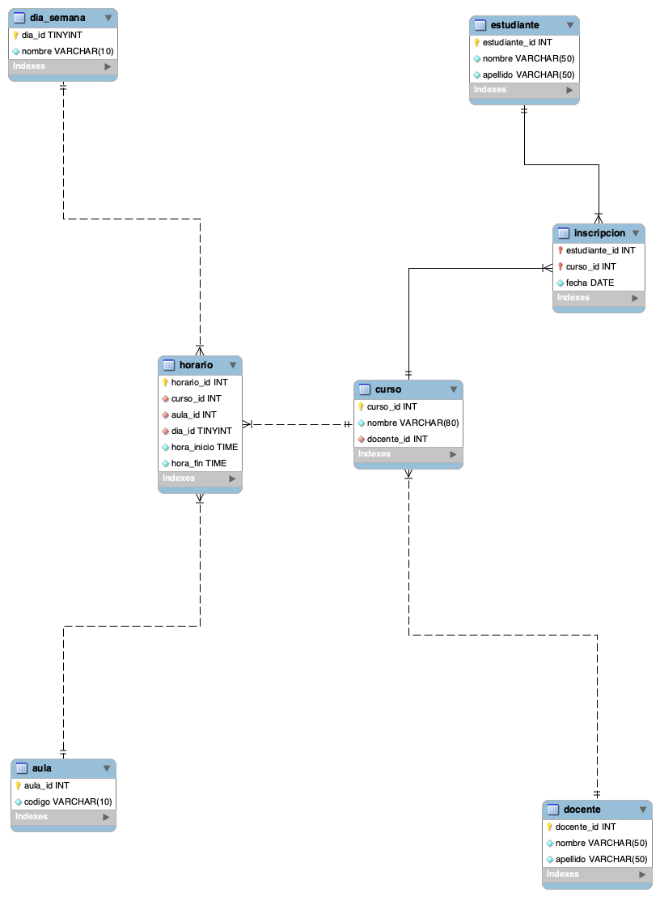

# Taller de normalización – Universidad

> Este repositorio es el resultado del ejercicio de normalización de una base de datos universitaria que partía de **una sola tabla llena de redundancias**. La idea era convertirla en algo más limpio, mantenible y sin datos repetidos. El recorrido completo lo hicimos desde la tabla original hasta la **Cuarta Forma Normal (4FN)**.

## Situación de partida

La universidad tenía todo en una tabla plana:

| Estudiante_ID | Nombre_Estudiante | Curso | Docente | Aula | Horario |
|---|---|---|---|---|---|
| 1 | Juan Pérez | Algoritmos | Carlos Gómez | Aula 101 | martes 10-12 |
| 2 | María Gómez | Algoritmos | Carlos Gómez | Aula 101 | martes 10-12 |
| 3 | Luis Ramírez | Redes | María Martínez | Aula 102 | Martes 14-16 |
| 4 | Ana Morales | Redes | María Martínez | Aula 102 | Martes 14-16 |
| 5 | Laura Rodríguez | Bases de Datos | José Rodríguez | Aula 103 | martes 8-10 |
| 6 | Daniel Hernández | Algoritmos | Carlos Gómez | Aula 101 | martes 10-12 |
| 7 | Carolina Sánchez | Redes | María Martínez | Aula 102 | Martes 14-16 |
| 8 | Mario López | Bases de Datos | José Rodríguez | Aula 103 | martes 8-10 |

Se veía bien a simple vista, pero tenía problemas de fondo:

- **Demasiada repetición**: cada vez que aparecía un estudiante de *Algoritmos*, se volvía a escribir Carlos Gómez, el Aula 101 y el horario.
- **Difícil de actualizar**: si *Algoritmos* cambiaba de aula, había que tocar muchas filas; si se olvidaba una, la base quedaba inconsistente.
- **Texto todo mezclado**: nombres completos, "Aula 101" y "martes 10-12" son cadenas que combinan varios datos en una sola celda.
- **Inconsistencias de escritura**: `martes` y `Martes` aparecían como si fueran cosas distintas.
- **Problemas clásicos**: no se podía registrar un curso sin estudiantes, y si se borraba el último estudiante de un curso se perdía el resto de la información.

## Diagrama E‑R



## Cómo lo fui arreglando

### 1. Primera Forma Normal (1FN) – valores atómicos y una buena clave

Lo primero fue dejar cada dato en su propia celda, sin columnas compuestas:

- `Nombre_Estudiante` se dividió en `nombre` y `apellido`.
- `Docente` también se dividió en `nombre` y `apellido`.
- `Aula` dejó de ser "Aula 101" y pasó a ser el código `101`.
- `Horario` se descompuso en `dia`, `hora_inicio` y `hora_fin`.
- Se normalizó el día para que `martes` y `Martes` sean lo mismo.

Como un estudiante puede estar en varios cursos, la clave primaria quedó como `(estudiante_id, curso)`.

Resultado: una tabla `inscripcion_1fn` con todos los campos separados.

### 2. Segunda Forma Normal (2FN) – eliminar dependencias parciales

Con la clave `(estudiante_id, curso)` nos dimos cuenta de que varios campos no dependían de toda la clave:

- `nombre` y `apellido` del estudiante dependen **solo** de `estudiante_id`.
- `docente`, `aula` y `horario` dependen **solo** de `curso`.

Entonces armamos:

- Tabla `estudiante`.
- Tabla `curso` con su propio `curso_id`.
- Tabla `inscripcion` solo con los pares `estudiante_id` – `curso_id`.

Así un curso puede existir sin estudiantes, y los datos del curso quedan en un solo lugar.

### 3. Tercera Forma Normal (3FN) – eliminar dependencias transitivas

En `curso` todavía quedaban cosas que no eran propias del curso:

- El nombre del docente es un dato del **docente**, no del curso.
- El aula y el día son entidades propias.

Así que creamos:

- `docente` (con su propio `docente_id`).
- `aula` (con `aula_id` y `codigo`).
- `dia_semana` (un catálogo con los 7 días, lo que elimina el problema `martes`/`Martes`).
- `horario` (la sesión de un curso: curso, aula, día, hora inicio y hora fin).

Y `curso` quedó solo con `curso_id` y `nombre`.

### 4. Cuarta Forma Normal (4FN) – evitar dependencias multivaluadas mezcladas

Ahora viene el paso que muchas veces se salta, pero que vale la pena hacer bien. En la realidad, un curso puede tener **varios docentes** (titular, auxiliar, laboratorio, etc.) y también **varios horarios** a la semana. Si guardamos docentes y horarios en la misma tabla, terminamos repitiendo combinaciones innecesariamente (producto cartesiano), y eso es justamente lo que corrige la 4FN.

Lo que hicimos:

- Sacamos la relación curso-docente a una tabla independiente: `curso_docente(curso_id, docente_id)`.
- Dejamos `horario` como la relación curso-horario-aula, independiente de cuántos docentes tenga el curso.

Con los datos de muestra cada curso tiene un solo docente, por lo que el contenido se ve igual que en 3FN, pero el modelo ya soporta múltiples docentes y sesiones sin generar redundancia. Esa es la gracia de la 4FN: no se trata solo de lo que hay ahora, sino de lo que puede pasar después.

## Modelo final

| Tabla | Clave primaria | Claves foráneas | Rol |
|---|---|---|---|
| `estudiante` | `estudiante_id` | – | Datos del estudiante |
| `docente` | `docente_id` | – | Datos del docente |
| `aula` | `aula_id` | – | Catálogo de aulas |
| `dia_semana` | `dia_id` | – | Catálogo de días |
| `curso` | `curso_id` | – | Asignatura |
| `curso_docente` | (`curso_id`, `docente_id`) | `curso_id`, `docente_id` | Quién dicta qué |
| `horario` | `horario_id` | `curso_id`, `aula_id`, `dia_id` | Cuándo y dónde es cada sesión |
| `inscripcion` | (`estudiante_id`, `curso_id`) | `estudiante_id`, `curso_id` | Quién cursa qué |

## Archivos del repositorio

| Archivo | Descripción |
|---|---|
| `ddl.sql` | Crea la base de datos y todas las tablas (MySQL/MariaDB, 4FN). |
| `dml.sql` | Carga los datos de muestra originales ya normalizados. |
| `dql.sql` | 5 consultas de ejemplo. |
| `diagrama_e_r.png` | Diagrama E-R |

Ejecutar en MySQL:

```bash
mysql -u root -p universidad < ddl.sql
mysql -u root -p universidad < dml.sql
mysql -u root -p universidad < dql.sql
```

## Consultas (`dql.sql`) y por qué funcionan mejor así

### 1. Reconstruir la tabla original

Une las tablas para mostrar la vista plana. Si alguna vez necesitás ver la información como antes, la obtenés con un `JOIN`, pero **no la guardamos repetida**.

**Beneficio**: cualquier cambio (por ejemplo el aula de *Algoritmos*) se hace en una sola fila de `horario` y se refleja en todos los resultados.

### 2. Estudiantes por curso y docente

Agrupamos por `curso_id` y usamos `GROUP_CONCAT` para listar los docentes. En la tabla plana el docente era texto libre y una variación de escritura rompería el agrupamiento.

**Beneficio**: el agrupamiento es exacto y soporta cursos con varios docentes gracias a `curso_docente`.

### 3. Ocupación de aulas y aulas libres

Filtramos y comparamos horas como valores `TIME`.

**Beneficio**: en lugar de parsear "martes 10-12" a mano, podemos comparar rangos (`hora_inicio < '12:00' AND hora_fin > '10:00'`) y listar aulas libres con `NOT EXISTS`.

### 4. Detección de choques de horario por docente

Buscamos pares de clases del mismo día con franjas que se solapan para el **mismo docente**, aunque sean cursos distintos.

**Beneficio**: en 4FN se usa `curso_docente` para saber qué docentes dictan cada curso, así que un choque se detecta aunque el docente imparta varias materias.

### 5. Carga académica semanal por docente

Sumamos las horas de cada docente a partir de `horario` y `curso_docente`.

**NOTA**: en la tabla plana el horario se repetía por cada estudiante inscrito, así que Carlos Gómez parecería tener 6 horas (3 estudiantes × 2 h) en lugar de 2. Con el modelo normalizado cada sesión existe una sola vez.

## Resumen de formas normales

| Forma | Qué corrige | Qué hicimos |
|---|---|---|
| **1FN** | Datos no atómicos y sin clave primaria | Separamos nombres, aula y horario en campos simples; unificamos `martes`/`Martes`; definimos la clave. |
| **2FN** | Dependencias parciales | Creamos `estudiante` y `curso`; `inscripcion` quedó solo como relación N:M. |
| **3FN** | Dependencias transitivas | Creamos `docente`, `aula` y `dia_semana`; sacamos el horario a su propia tabla. |
| **4FN** | Dependencias multivaluadas | Separamos la relación curso-docente (`curso_docente`) de la relación curso-horario (`horario`). |
